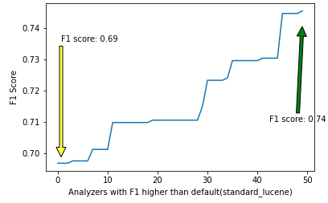

## EntityDisambiguation
This document proposes a methodology to disambiguate misspelled entities by comparing the search retrieval 
performance with different custom search analyzers in a search engine.
 Hence, even if the provided query contains some misspelled entities, 
 the search engine can respond to the request with higher precision and 
 recall than the default settings. This method can be applied to any 
 search engine service capable of adding custom search analyzers.
 
## Motivation
Figure below indicates the overall architecture from user speech to search the data source and respond to the user’s request. 

- User: Hey device, call “Jean Heng”  
- Device: Sorry I cannot find “John Hang”  


## Methodology

Our approach is to measure the performance of the search engine in the retrieval of the misspelled personaName when the search engine uses specific or multi search analyzers.

## Usage

### Create a Search Index and insert documents in the index:
- Search index will be created from the [index-schema.json](resource/index-schema.json) file
- documents are people names sourcing from [names.csv](resources/names.csv)

```python
from azuresearchclient import AzureSearchClient

AZURE = AzureSearchClient()
# Create Search Index
AZURE.create_index("test-index")
# insert documents into the search index (corrected spelled names)
AZURE.insert_documents("test-index")
```
### Query the search index by providing misspelled names and calculate the performance
- Create a set of all analyzers(fields)
- load misspelled names from [names-misspelled.csv](resources/names-misspelled.csv)
- load the expected names/results from [names-expected.csv](resources/names-expected.csv)
- for all elements in teh subset:
- send a query to the search index providing the missepelled name and target field
    - Mark the reponse (e.g. TP, TN, FP, FN)
    - Calculate the Precision, Recall and F1 score
- statistics will be stored in [generated](generated) directory

```python
from constants import Constants
from statistics import Statistics

STATS = Statistics()
# target fields to be searched
FIELDS_SET = Constants.name_search_fields
all_subsets = STATS.utils.get_subsets(FIELDS_SET)
# list of correct names (already uploaded to the search index)
correct_list = STATS.utils.read_csv("names-expected.csv")
# list of misspelled names
misspelled_list = STATS.utils.read_csv("names-misspelled.csv")
# making queries (with misspelled names) and measure the result
STATS.calculate_statistics(correct_list, misspelled_list, all_subsets, AZURE, True)
```
### Plot the F1 score for each Analyzer

```python
from statistics import Statistics

STATS = Statistics()
SCORES = STATS.generate_f1()
STATS.create_plot(SCORES)
```

